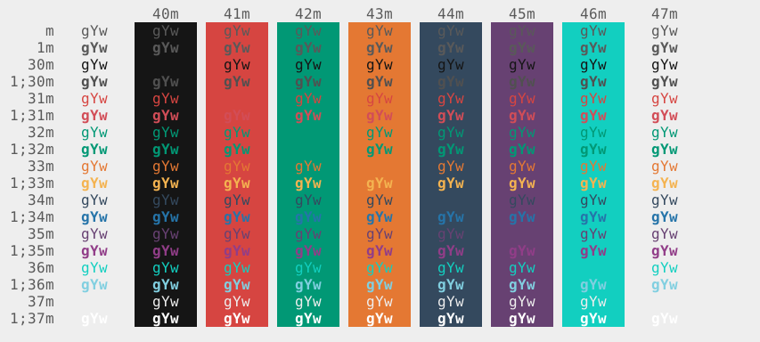

# isooth

A customized light theme for xfce-terminal that uses beautiful flat colors.

## Screenshot

## Installation

* clone the directory or download the zip file
* copy 'isooth.theme' file to '~/.local/share/xfce4/terminal/colorschemes/'
* open terminal
* Edit->Preferences->Colors->Presets
* click on load presets and select isooth from the list
* close the preferences menu